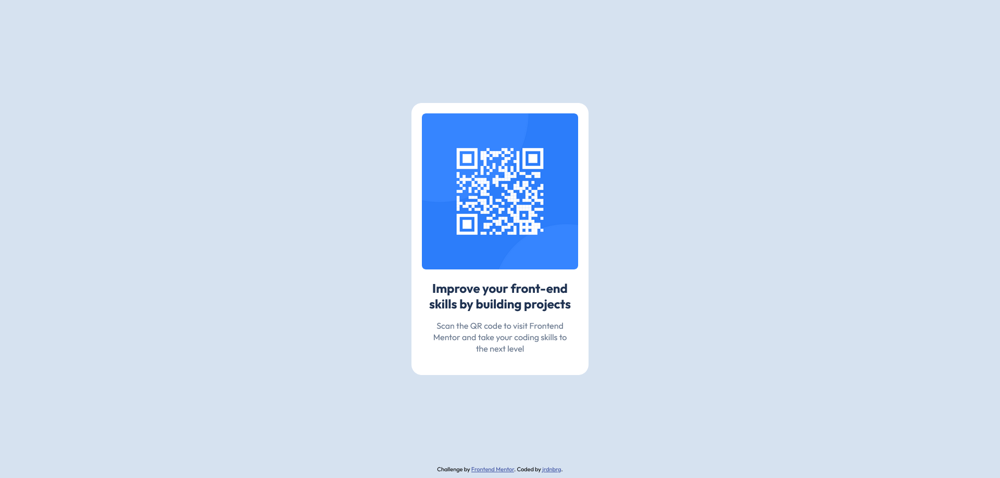

# Frontend Mentor - QR code component solution

This is a solution to the [QR code component challenge on Frontend Mentor](https://www.frontendmentor.io/challenges/qr-code-component-iux_sIO_H). Frontend Mentor challenges help you improve your coding skills by building realistic projects. 

## Table of contents

- [Overview](#overview)
- [Screenshot](#screenshot)
- [Links](#links)
- [Built with](#built-with)
- [What I learned](#what-i-learned)
- [Useful resources](#useful-resources)

## Overview
This was a simple and quick project to get started with Frontend Mentor challenges. It is a webpage that shows a QR code component.

## Screenshot



## Links

- Live Site URL: https://jrdnbrg.github.io/qr-code-component/

## Built with

- Semantic HTML5 markup
- Flexbox

## What I learned
I was struggling with centering the QR code component on the page, because I didn't know how to make the body the same height as the page/screen. Eventually, I learned to do it like this:

```css
.body {
  height: 100vh;
}
```

## Useful resources

- [HTML vs Body: How to Set Width and Height for Full Page Size](https://www.freecodecamp.org/news/html-page-width-height/) - This article helped me understand how to make the body the size of page.
